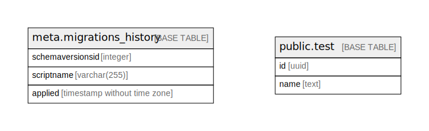

# hackathon

## Tables

| Name                                                  | Columns | Comment                                       | Type       |
| ----------------------------------------------------- | ------- | --------------------------------------------- | ---------- |
| [meta.migrations_history](meta.migrations_history.md) | 3       |                                               | BASE TABLE |
| [public.test](public.test.md)                         | 3       |                                               | BASE TABLE |
| [public.users](public.users.md)                       | 5       | Core user account information.                | BASE TABLE |
| [enums.user_audit_events](enums.user_audit_events.md) | 2       |                                               | BASE TABLE |
| [public.user_audit](public.user_audit.md)             | 5       | Tracks audit events related to user accounts. | BASE TABLE |

## Stored procedures and functions

| Name                           | ReturnType | Arguments            | Type     |
| ------------------------------ | ---------- | -------------------- | -------- |
| public.base32_encode           | text       | id uuid              | FUNCTION |
| public.base32_decode           | uuid       | s text               | FUNCTION |
| public.typeid_encode           | text       | prefix text, id uuid | FUNCTION |
| public.uuid_from_typeid        | uuid       | typeid_str text      | FUNCTION |
| public.uuid_typeid_eq_operator | bool       | lhs uuid, rhs text   | FUNCTION |
| public.set_updated_at          | trigger    |                      | FUNCTION |

## Relations

---

> Generated by [tbls](https://github.com/k1LoW/tbls)
