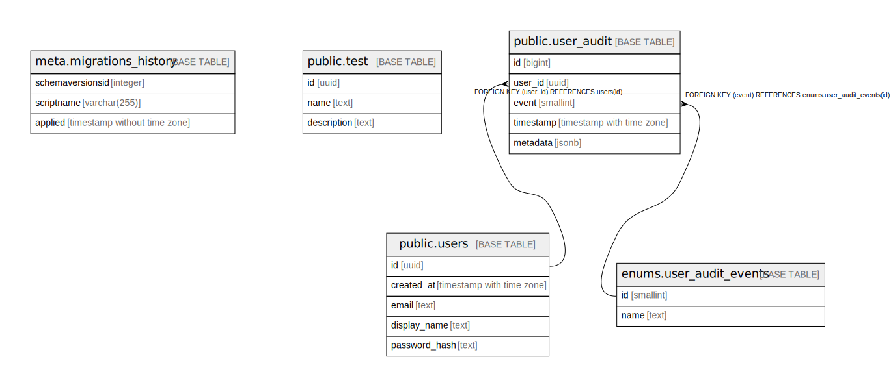

# hackathon

## Tables

| Name                                                  | Columns | Comment | Type       |
| ----------------------------------------------------- | ------- | ------- | ---------- |
| [meta.migrations_history](meta.migrations_history.md) | 3       |         | BASE TABLE |
| [public.test](public.test.md)                         | 2       |         | BASE TABLE |

## Stored procedures and functions

| Name                           | ReturnType | Arguments          | Type     |
| ------------------------------ | ---------- | ------------------ | -------- |
| public.base32_encode           | text       | id uuid            | FUNCTION |
| public.base32_decode           | uuid       | s text             | FUNCTION |
| public.uuid_from_typeid        | uuid       | typeid_str text    | FUNCTION |
| public.uuid_typeid_eq_operator | bool       | lhs uuid, rhs text | FUNCTION |

## Relations

---

> Generated by [tbls](https://github.com/k1LoW/tbls)
