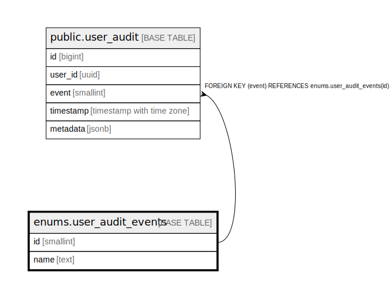

# enums.user_audit_events

## Description

## Columns

| Name | Type     | Default | Nullable | Children                                  | Parents | Comment |
| ---- | -------- | ------- | -------- | ----------------------------------------- | ------- | ------- |
| id   | smallint |         | false    | [public.user_audit](public.user_audit.md) |         |         |
| name | text     |         | false    |                                           |         |         |

## Constraints

| Name                            | Type        | Definition       |
| ------------------------------- | ----------- | ---------------- |
| user_audit_events_id_not_null   | n           | NOT NULL id      |
| user_audit_events_name_not_null | n           | NOT NULL name    |
| user_audit_events_pkey          | PRIMARY KEY | PRIMARY KEY (id) |
| user_audit_events_name_key      | UNIQUE      | UNIQUE (name)    |

## Indexes

| Name                       | Definition                                                                                   |
| -------------------------- | -------------------------------------------------------------------------------------------- |
| user_audit_events_pkey     | CREATE UNIQUE INDEX user_audit_events_pkey ON enums.user_audit_events USING btree (id)       |
| user_audit_events_name_key | CREATE UNIQUE INDEX user_audit_events_name_key ON enums.user_audit_events USING btree (name) |

## Relations

---

> Generated by [tbls](https://github.com/k1LoW/tbls)
