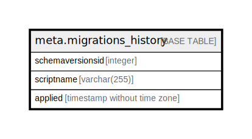

# meta.migrations_history

## Description

## Columns

| Name             | Type                        | Default                                                           | Nullable | Children | Parents | Comment |
| ---------------- | --------------------------- | ----------------------------------------------------------------- | -------- | -------- | ------- | ------- |
| schemaversionsid | integer                     | nextval('meta.migrations_history_schemaversionsid_seq'::regclass) | false    |          |         |         |
| scriptname       | varchar(255)                |                                                                   | false    |          |         |         |
| applied          | timestamp without time zone |                                                                   | false    |          |         |         |

## Constraints

| Name                                         | Type        | Definition                     |
| -------------------------------------------- | ----------- | ------------------------------ |
| migrations_history_applied_not_null          | n           | NOT NULL applied               |
| migrations_history_schemaversionsid_not_null | n           | NOT NULL schemaversionsid      |
| migrations_history_scriptname_not_null       | n           | NOT NULL scriptname            |
| PK_migrations_history_Id                     | PRIMARY KEY | PRIMARY KEY (schemaversionsid) |

## Indexes

| Name                     | Definition                                                                                               |
| ------------------------ | -------------------------------------------------------------------------------------------------------- |
| PK_migrations_history_Id | CREATE UNIQUE INDEX "PK_migrations_history_Id" ON meta.migrations_history USING btree (schemaversionsid) |

## Relations

---

> Generated by [tbls](https://github.com/k1LoW/tbls)
