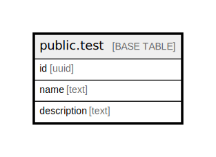

# public.test

## Description

## Columns

| Name | Type | Default | Nullable | Children | Parents | Comment |
| ---- | ---- | ------- | -------- | -------- | ------- | ------- |
| id   | uuid |         | false    |          |         |         |
| name | text |         | false    |          |         |         |

## Constraints

| Name               | Type        | Definition       |
| ------------------ | ----------- | ---------------- |
| test_id_not_null   | n           | NOT NULL id      |
| test_name_not_null | n           | NOT NULL name    |
| test_pkey          | PRIMARY KEY | PRIMARY KEY (id) |

## Indexes

| Name      | Definition                                                    |
| --------- | ------------------------------------------------------------- |
| test_pkey | CREATE UNIQUE INDEX test_pkey ON public.test USING btree (id) |

## Relations

---

> Generated by [tbls](https://github.com/k1LoW/tbls)
