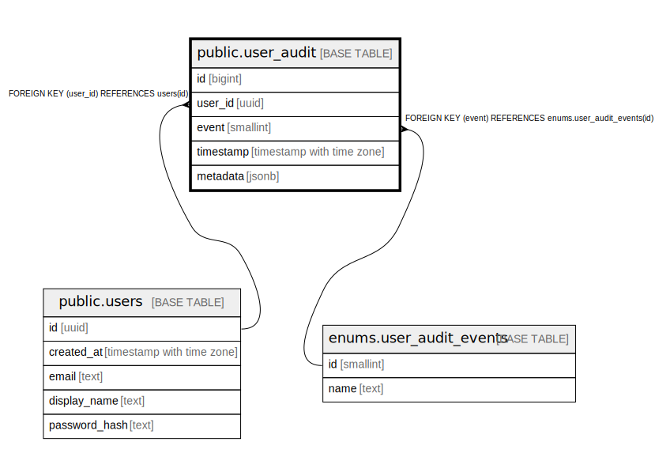

# public.user_audit

## Description

Tracks audit events related to user accounts.

## Columns

| Name      | Type                     | Default | Nullable | Children | Parents                                               | Comment |
| --------- | ------------------------ | ------- | -------- | -------- | ----------------------------------------------------- | ------- |
| id        | bigint                   |         | false    |          |                                                       |         |
| user_id   | uuid                     |         | false    |          | [public.users](public.users.md)                       |         |
| event     | smallint                 |         | false    |          | [enums.user_audit_events](enums.user_audit_events.md) |         |
| timestamp | timestamp with time zone |         | false    |          |                                                       |         |
| metadata  | jsonb                    |         | false    |          |                                                       |         |

## Constraints

| Name                          | Type        | Definition                                                 |
| ----------------------------- | ----------- | ---------------------------------------------------------- |
| user_audit_event_not_null     | n           | NOT NULL event                                             |
| user_audit_id_not_null        | n           | NOT NULL id                                                |
| user_audit_metadata_not_null  | n           | NOT NULL metadata                                          |
| user_audit_timestamp_not_null | n           | NOT NULL "timestamp"                                       |
| user_audit_user_id_not_null   | n           | NOT NULL user_id                                           |
| user_audit_user_id_fkey       | FOREIGN KEY | FOREIGN KEY (user_id) REFERENCES users(id)                 |
| user_audit_event_fkey         | FOREIGN KEY | FOREIGN KEY (event) REFERENCES enums.user_audit_events(id) |
| user_audit_pkey               | PRIMARY KEY | PRIMARY KEY (id)                                           |

## Indexes

| Name                 | Definition                                                                       |
| -------------------- | -------------------------------------------------------------------------------- |
| user_audit_pkey      | CREATE UNIQUE INDEX user_audit_pkey ON public.user_audit USING btree (id)        |
| user_audit_user_id   | CREATE INDEX user_audit_user_id ON public.user_audit USING btree (user_id)       |
| user_audit_event     | CREATE INDEX user_audit_event ON public.user_audit USING btree (event)           |
| user_audit_timestamp | CREATE INDEX user_audit_timestamp ON public.user_audit USING btree ("timestamp") |

## Relations

---

> Generated by [tbls](https://github.com/k1LoW/tbls)
