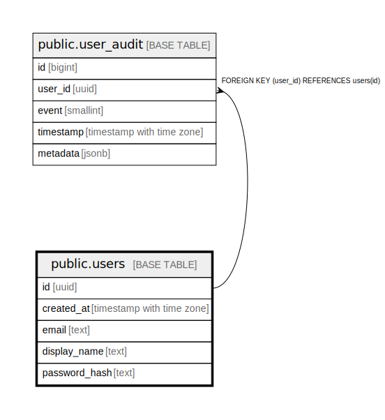

# public.users

## Description

Core user account information.

## Columns

| Name          | Type                     | Default                          | Nullable | Children                                  | Parents | Comment |
| ------------- | ------------------------ | -------------------------------- | -------- | ----------------------------------------- | ------- | ------- |
| id            | uuid                     |                                  | false    | [public.user_audit](public.user_audit.md) |         |         |
| created_at    | timestamp with time zone | (now() AT TIME ZONE 'utc'::text) | false    |                                           |         |         |
| email         | text                     |                                  | false    |                                           |         |         |
| display_name  | text                     |                                  | false    |                                           |         |         |
| password_hash | text                     |                                  | false    |                                           |         |         |

## Constraints

| Name                         | Type        | Definition                                                              |
| ---------------------------- | ----------- | ----------------------------------------------------------------------- |
| users_created_at_not_null    | n           | NOT NULL created_at                                                     |
| users_display_name_check     | CHECK       | CHECK (((length(display_name) >= 2) AND (length(display_name) <= 100))) |
| users_display_name_not_null  | n           | NOT NULL display_name                                                   |
| users_email_check            | CHECK       | CHECK (((length(email) >= 3) AND (length(email) <= 254)))               |
| users_email_not_null         | n           | NOT NULL email                                                          |
| users_id_not_null            | n           | NOT NULL id                                                             |
| users_password_hash_check    | CHECK       | CHECK ((length(password_hash) < 1000))                                  |
| users_password_hash_not_null | n           | NOT NULL password_hash                                                  |
| users_pkey                   | PRIMARY KEY | PRIMARY KEY (id)                                                        |
| users_email_key              | UNIQUE      | UNIQUE (email)                                                          |
| users_display_name_key       | UNIQUE      | UNIQUE (display_name)                                                   |

## Indexes

| Name                   | Definition                                                                            |
| ---------------------- | ------------------------------------------------------------------------------------- |
| users_pkey             | CREATE UNIQUE INDEX users_pkey ON public.users USING btree (id)                       |
| users_email_key        | CREATE UNIQUE INDEX users_email_key ON public.users USING btree (email)               |
| users_display_name_key | CREATE UNIQUE INDEX users_display_name_key ON public.users USING btree (display_name) |

## Relations

---

> Generated by [tbls](https://github.com/k1LoW/tbls)
